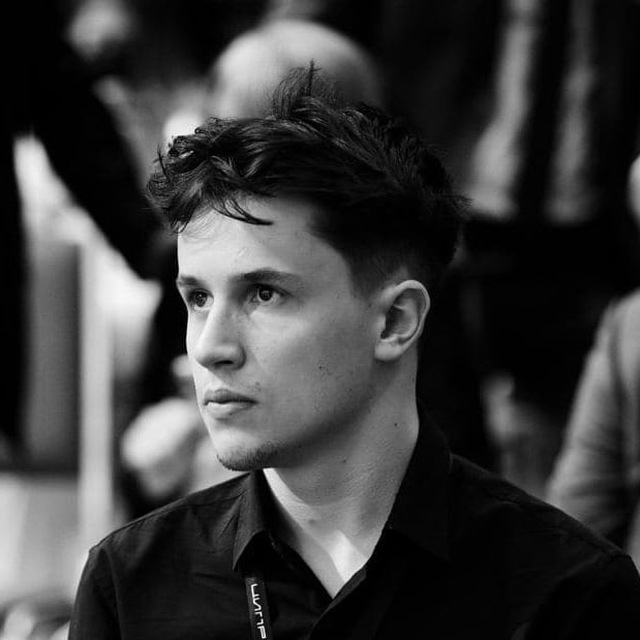

# Введение в машинное обучение
Курс представляет собой изложение основных алгоритмов машинного обучения и методов решения прикладных задач. Курс содержит как теоритический, так и практический материал. 

Каждое занятие состоит из лекции на 90 минут и семинара на 60 минут. Успешное выполнение домашних заданий гарантирует прохождение курса.

* [🚀 Программа](/docs/program)
* [🧠 Слушатели](/docs/students)
* [📧 Чат](https://t.me/+vEZLTQ9wWT44OTRi)
* [📧 Канал](https://t.me/+JuVvTYm2i9pjYjg6)
* [👨‍💻 Github](https://github.com/MISISAILab/MISISAILab.github.io)

| Иванов Арсений | Калязин Николай | Братчиков Сергей | Новицкий Лев |
| ------------ | ------------- | ------------- | ------------- |
|  |  |  |   |
| Researcher   Tg: <https://t.me/arsmathprog>   Tg-канал: <https://t.me/ivarsivars> | Researcher   Tg:  <https://t.me/FanatBoba>  |  University 20.35   Tg:  <https://t.me/hivaze>  | Researcher   Tg:  <https://t.me/leffffffffffff> |

Октябрь, 2022 г.
