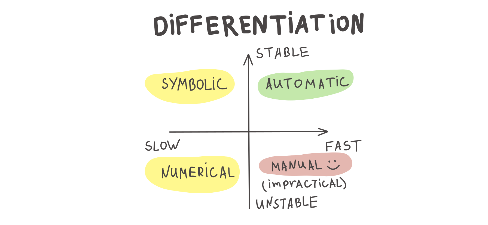

# Brief recap of matrix calculus

## Useful definitions and notations
We will treat all vectors as column vectors by default.
### Matrix and vector multiplication
Let $$A$$ be $$m \times n$$, and $$B$$ be $$n \times p$$, and let the product $$AB$$ be:

$$
C = AB
$$

then $$C$$ is a $$m \times p$$ matrix, with element $$(i, j)$$ given by: 

$$
c_{ij} = \sum_{k=1}^n a_{ik}b_{kj}
$$

Let $$A$$ be $$m \times n$$, and $$x$$ be $$n \times 1$$, then the typical element of the product:

$$
z = Ax
$$

is given by:

$$
z_i = \sum_{k=1}^n a_{ik}x_k
$$

Finally, just to remind:

* $$C = AB \quad C^\top = B^\top A^\top$$
* $$AB \neq BA$$
* $$e^{A} =\sum\limits_{k=0}^{\infty }{1 \over k!}A^{k}$$
* $$e^{A+B} \neq e^{A} e^{B}$$ (but if $$A$$ and $$B$$ are commuting matrices, which means that $$AB = BA$$, $$e^{A+B} = e^{A} e^{B}$$)
* $$\langle x, Ay\rangle = \langle A^\top x, y\rangle$$

### Gradient
Let  $$f(x):\mathbb{R}^n→\mathbb{R}$$, then vector, which contains all first order partial derivatives:

$$
\nabla f(x) = \dfrac{df}{dx} = \begin{pmatrix}
    \frac{\partial f}{\partial x_1} \\
    \frac{\partial f}{\partial x_2} \\
    \vdots \\
    \frac{\partial f}{\partial x_n}
\end{pmatrix}
$$

### Hessian 
Let  $$f(x):\mathbb{R}^n→\mathbb{R}$$, then matrix, containing all the second order partial derivatives:

$$
f''(x) = \dfrac{\partial^2 f}{\partial x_i \partial x_j} = \begin{pmatrix}
    \frac{\partial^2 f}{\partial x_1 \partial x_1} & \frac{\partial^2 f}{\partial x_1 \partial x_2} & \dots  & \frac{\partial^2 f}{\partial x_1\partial x_n} \\
    \frac{\partial^2 f}{\partial x_2 \partial x_1} & \frac{\partial^2 f}{\partial x_2 \partial x_2} & \dots  & \frac{\partial^2 f}{\partial x_2 \partial x_n} \\
    \vdots & \vdots & \ddots & \vdots \\
    \frac{\partial^2 f}{\partial x_n \partial x_1} & \frac{\partial^2 f}{\partial x_n \partial x_2} & \dots  & \frac{\partial^2 f}{\partial x_n \partial x_n}
\end{pmatrix}
$$

But actually, Hessian could be a tensor in such a way: $$\left(f(x): \mathbb{R}^n \to \mathbb{R}^m \right)$$ is just 3d tensor, every slice is just hessian of corresponding scalar function $$\left( H\left(f_1(x)\right), H\left(f_2(x)\right), \ldots, H\left(f_m(x)\right)\right)$$.

### Jacobian
The extension of the gradient of multidimensional  $$f(x):\mathbb{R}^n→\mathbb{R}^m$$ :

$$
f'(x) = \dfrac{df}{dx^T} = \begin{pmatrix}
    \frac{\partial f_1}{\partial x_1} & \frac{\partial f_1}{\partial x_2} & \dots  & \frac{\partial f_1}{\partial x_n} \\
    \frac{\partial f_2}{\partial x_1} & \frac{\partial f_2}{\partial x_2} & \dots  & \frac{\partial f_2}{\partial x_n} \\
    \vdots & \vdots & \ddots & \vdots \\
    \frac{\partial f_m}{\partial x_1} & \frac{\partial f_m}{\partial x_2} & \dots  & \frac{\partial f_m}{\partial x_n}
\end{pmatrix}
$$

### Summary


$$
f(x) : X \to Y; \;\;\;\;\;\;\;\; \frac{\partial f(x)}{\partial x} \in G
$$

|             X             |        Y       |             G             |                   Name                  |
|:-------------------------:|:--------------:|:-------------------------:|:----------------------------------------------:|
|        $$\mathbb{R}$$       |  $$\mathbb{R}$$  |        $$\mathbb{R}$$       |              $$f'(x)$$ (derivative)             |
|       $$\mathbb{R}^n$$      |  $$\mathbb{R}$$  |       $$\mathbb{R^n}$$      |  $$\dfrac{\partial f}{\partial x_i}$$ (gradient) |
|       $$\mathbb{R}^n$$      | $$\mathbb{R}^m$$ | $$\mathbb{R}^{m \times n}$$ | $$\dfrac{\partial f_i}{\partial x_j}$$ (jacobian) |
| $$\mathbb{R}^{m \times n}$$ |  $$\mathbb{R}$$  | $$\mathbb{R}^{m \times n}$$ |      $$\dfrac{\partial f}{\partial x_{ij}}$     |

named gradient of  $$f(x)$$. This vector indicates the direction of the steepest ascent. Thus, vector  $$−\nabla f(x)$$  means the direction of the steepest descent of the function in the point. Moreover, the gradient vector is always orthogonal to the contour line in the point.

## General concept

The idea implies formulating a set of simple rules, which allows you to calculate derivatives just like in a scalar case. It might be convenient to use the differential notation here.

### Differentials
After obtaining the differential notation of $$df$$ we can retrieve the gradient using the following formula:

$$
df(x) = \langle \nabla f(x), dx\rangle
$$

Then, if we have a differential of the above form and we need to calculate the second derivative of the matrix/vector function, we treat "old" $$dx$$ as the constant $$dx_1$$, then calculate $$d(df)$$

$$
d^2f(x) = \langle \nabla^2 f(x) dx_1, dx_2\rangle = \langle H_f(x) dx_1, dx_2\rangle
$$

### Properties

Let $$A$$ and $$B$$ be the constant matrices, while $$X$$ and $$Y$$ are the variables (or matrix functions).

* $$dA = 0$$
* $$d(\alpha X) = \alpha (dX)$$
* $$d(AXB) = A(dX )B$$
* $$d(X+Y) = dX + dY$$
* $$d(X^\top) = (dX)^\top$$
* $$d(XY) = (dX)Y + X(dY)$$
* $$d\langle X, Y\rangle = \langle dX, Y\rangle+ \langle X, dY\rangle$$
* $$d\left( \dfrac{X}{\phi}\right) = \dfrac{\phi dX - (d\phi) X}{\phi^2}$$
* $$d\left( \det X \right) = \det X \langle X^{-\top}, dX \rangle $$
* $$d\left(\text{tr } X \right) = \langle I, dX\rangle$$
* $$df(g(x)) = \dfrac{df}{dg} \cdot dg(x)$$
* $$H = (J(\nabla f))^T$$
* $$ d(X^{-1})=-X^{-1}(dX)X^{-1}$$


## References
* [Good introduction](https://atmos.washington.edu/~dennis/MatrixCalculus.pdf)
* [The Matrix Cookbook](https://www.math.uwaterloo.ca/~hwolkowi/matrixcookbook.pdf)
* [MSU seminars](http://www.machinelearning.ru/wiki/images/a/ab/MOMO18_Seminar1.pdf) (Rus.)
* [Online tool](http://www.matrixcalculus.org/) for analytic expression of a derivative.
* [Determinant derivative](https://charlesfrye.github.io/math/2019/01/25/frechet-determinant.html)


# Examples
## Example 1
Find $$\nabla f(x)$$, if $$f(x) = \dfrac{1}{2}x^TAx + b^Tx + c$$.


## Example 2
Find $$\nabla f(x), f''(x)$$, if $$f(x) = -e^{-x^Tx}$$.


## Example 3
Find $$\nabla f(X)$$, if $$f(X) = \langle S, X\rangle - \log \det X$$.


## Example 4
Find $$\nabla f(X)$$, if $$f(X) = \ln \langle Ax, x\rangle, A \in \mathbb{S^n_{++}}$$


# Automatic differentiation
## Idea

Automatic differentiation is a scheme, that allows you to compute a value of the gradient of function with a cost of computing function itself only twice.
### Chain rule
We will illustrate some important matrix calculus facts for specific cases
#### Univariate chain rule
Suppose, we have the following functions $$R: \mathbb{R} \to \mathbb{R} , L: \mathbb{R} \to \mathbb{R}$$ and $$W \in \mathbb{R}$$. Then

$$
\dfrac{\partial R}{\partial W} = \dfrac{\partial R}{\partial L} \dfrac{\partial L}{\partial W}
$$

#### Multivariate chain rule

The simplest example:

$$
\dfrac{\partial }{\partial t} f(x_1(t), x_2(t)) = \dfrac{\partial f}{\partial x_1} \dfrac{\partial x_1}{\partial t} + \dfrac{\partial f}{\partial x_2} \dfrac{\partial x_2}{\partial t}
$$

Now, we'll consider $$f: \mathbb{R}^n \to \mathbb{R}$$:

$$
\dfrac{\partial }{\partial t} f(x_1(t), \ldots, x_n(t)) = \dfrac{\partial f}{\partial x_1} \dfrac{\partial x_1}{\partial t} + \ldots + \dfrac{\partial f}{\partial x_n} \dfrac{\partial x_n}{\partial t}
$$

But if we will add another dimension $$f: \mathbb{R}^n \to \mathbb{R}^m$$, then the $$j$$-th output of $$f$$ will be:

$$
\dfrac{\partial }{\partial t} f_j(x_1(t), \ldots, x_n(t)) = \sum\limits_{i=1}^n \dfrac{\partial f_j}{\partial x_i} \dfrac{\partial x_i}{\partial t} = \sum\limits_{i=1}^n J_{ji}  \dfrac{\partial x_i}{\partial t},
$$

where matrix $$J \in \mathbb{R}^{m \times n}$$ is the jacobian of the $$f$$. Hence, we could write it in a vector way:

$$
\dfrac{\partial f}{\partial t} = J^\top \dfrac{\partial x}{\partial t}\quad \iff \quad \left(\dfrac{\partial f}{\partial t}\right)^\top =  \left( \dfrac{\partial x}{\partial t}\right)^\top J
$$


### Backpropagation
The whole idea came from the applying chain rule to the computation graph of primitive operations

$$
L = L\left(y\left(z(w,x,b)\right), t\right) 
$$


$$
\begin{aligned}
&z = wx+b   &\frac{\partial z}{\partial w} =x, \frac{\partial z}{\partial x} =w, \frac{\partial z}{\partial b} =0  \\
&y = \sigma(z) &\frac{\partial y}{\partial z} =\sigma'(z)\\
&L = \dfrac{1}{2}(y-t)^2 &\frac{\partial L}{\partial y} =y-t, \frac{\partial L}{\partial t} = t -y 
\end{aligned}
$$

All frameworks for automatic differentiation construct (implicitly or explicitly) computation graph. In deep learning, we typically want to compute the derivatives of the loss function $$L$$ w.r.t. each intermediate parameter to tune them via gradient descent. For this purpose it is convenient to use the following notation:

$$
\overline{v_i} = \dfrac{\partial L}{\partial v_i}
$$

Let $$v_1, . . . , v_N$$ be a topological ordering of the computation graph (i.e. parents come before children). $$v_N$$ denotes the variable we’re trying to compute derivatives of (e.g. loss).

#### Forward pass:
* For $$i = 1, \ldots, N$$:
	* Compute $$v_i$$ as a function of its parents.

#### Backward pass:
* \$$\overline{v_N} = 1$$
* For $$i = N-1, \ldots, 1$$:
	* Compute derivatives $$\overline{v_i} = \sum\limits_{j \in \text{Children}(v_i)}\overline{v_j}\dfrac{\partial v_j}{\partial v_i}$$

Note, that $$\overline{v_j}$$ term is coming from the children of $$\overline{v_i}$$, while $$\dfrac{\partial v_j}{\partial v_i}$$ is already precomputed effectively.

### Jacobian vector product
The reason why it works so fast in practice is that the Jacobian of the operations is already developed effectively in automatic differentiation frameworks. Typically, we even do not construct or store the full Jacobian, doing matvec directly instead.

#### Example: element-wise exponent

$$
y = \exp{(z)} \qquad J = \text{diag}(\exp(z)) \qquad \overline{z} = \overline{y} J
$$

See the examples of Vector-Jacobian Products from autodidact library:

```python
defvjp(anp.add,         lambda g, ans, x, y : unbroadcast(x, g),
                        lambda g, ans, x, y : unbroadcast(y, g))
defvjp(anp.multiply,    lambda g, ans, x, y : unbroadcast(x, y * g),
                        lambda g, ans, x, y : unbroadcast(y, x * g))
defvjp(anp.subtract,    lambda g, ans, x, y : unbroadcast(x, g),
                        lambda g, ans, x, y : unbroadcast(y, -g))
defvjp(anp.divide,      lambda g, ans, x, y : unbroadcast(x,   g / y),
                        lambda g, ans, x, y : unbroadcast(y, - g * x / y**2))
defvjp(anp.true_divide, lambda g, ans, x, y : unbroadcast(x,   g / y),
                        lambda g, ans, x, y : unbroadcast(y, - g * x / y**2))
```

### Hessian vector product
Interesting, that a similar idea could be used to compute Hessian-vector products, which is essential for second order optimization or conjugate gradient methods. For a scalar-valued function $$f : \mathbb{R}^n \to \mathbb{R}$$ with continuous second derivatives (so that the Hessian matrix is symmetric), the Hessian at a point $$x \in \mathbb{R}^n$$ is written as $$\partial^2 f(x)$$. A Hessian-vector product function is then able to evaluate

$$
v \mapsto \partial^2 f(x) \cdot v
$$

for any vector $$v \in \mathbb{R}^n$$.

The trick is not to instantiate the full Hessian matrix: if $$n$$ is large, perhaps in the millions or billions in the context of neural networks, then that might be impossible to store. Luckily, `grad` (in the jax/autograd/pytorch/tensorflow) already gives us a way to write an efficient Hessian-vector product function. We just have to use the identity

$$
\partial^2 f (x) v = \partial [x \mapsto \partial f(x) \cdot v] = \partial g(x),
$$

where $$g(x) = \partial f(x) \cdot v$$ is a new scalar-valued function that dots the gradient of $$f$$ at $$x$$ with the vector $$v$$. Notice that we're only ever differentiating scalar-valued functions of vector-valued arguments, which is exactly where we know `grad` is efficient.


```python
import jax.numpy as jnp

def hvp(f, x, v):
    return grad(lambda x: jnp.vdot(grad(f)(x), v))(x)
```
## Code

[](https://colab.research.google.com/github/MerkulovDaniil/optim/blob/master/assets/Notebooks/Autograd.ipynb)

## Materials

* [Autodidact](https://github.com/mattjj/autodidact) - a pedagogical implementation of Autograd
* [CSC321](https://www.cs.toronto.edu/~rgrosse/courses/csc321_2018/slides/lec06.pdf) Lecture 6
* [CSC321](https://www.cs.toronto.edu/~rgrosse/courses/csc321_2018/slides/lec10.pdf) Lecture 10
* [Why](https://medium.com/@karpathy/yes-you-should-understand-backprop-e2f06eab496b) you should understand backpropagation :)
* [JAX autodiff cookbook](https://jax.readthedocs.io/en/latest/notebooks/autodiff_cookbook.html)